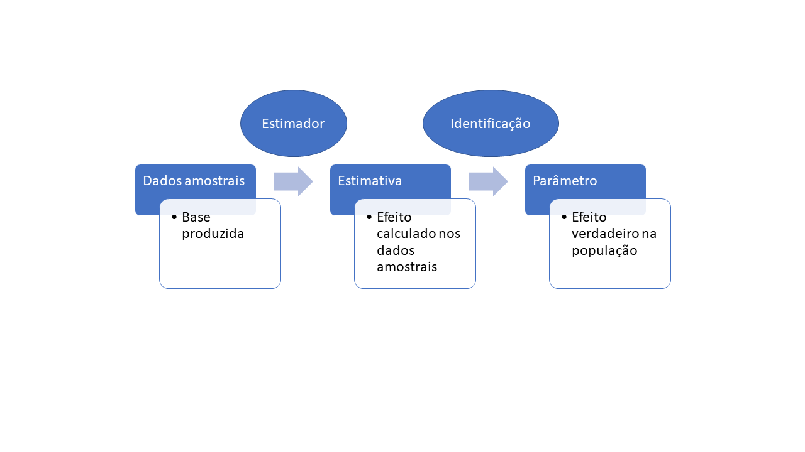

```{r, include=FALSE}
library(tidyverse)
library(kableExtra)
library(faux)
library(gridExtra)
library(RColorBrewer)
library(stargazer)
library(gridtext)
library(ggdag)
library(dagitty)
```

## Introdução

$$
$$


Um dos principais desafios metodológicos enfrentados pela Economia e Ciência Política consiste em avaliar o impacto de políticas públicas.

* A política de transferência condicional de renda aumentou os anos de escolaridade dos filhos das famílias beneficiadas pelo programa?

* O aumento do salário mínimo eleva o desemprego?


## Introdução

$$
$$

Para evitar vieses na análise, são utilizados desenhos experimentais ou quase-experimentais de difícil compreensão para alunos pouco versados em econometria e estatística


Neste trabalho proponho a utilização de bases simuladas para ensinar de forma didática a intuição por trás desses desenhos e apresento exemplos práticos.


Para tanto, foi desenvolvida uma função em R que pode ser acessada pelo [link](https://github.com/Lucasfm108/causalsim)

## O problema fundamental da inferência causal

$$
$$

```{r, echo=F}
dag <- dagitty("dag {
  X -> Y
  }")
coordinates(dag) <-  list(
  x=c(X=1, Y=3),
  y=c(X=2, Y=2))

tidy_dag <- tidy_dagitty(dag)
ggdag(tidy_dag,text_size = 10,
      node_size = 20) +
  theme_dag()
```


## O problema fundamental da inferência causal

$$
$$

```{r, echo=F}
a <- data.frame(Escolaridade=c("Ensino superior","Ensino Médio/Fundamental"),
                `Renda Média`=c(4000,1000)) 

rownames(a) <- c("Grupo 1","Grupo 2")

kbl(a, booktabs = T, caption="Nível de escolaridade x Renda entre grupos incomparáveis") %>%
kable_paper( "hover", full_width = F)
```

## O problema fundamental da inferência causal

$$
$$

Podemos afirmar com segurança que obter um diploma de nível superior "causa" um aumento médio na renda mensal de R$3.000,00?

$Renda_{pais}[Alunos_{\text{Ensino superior}}] > Renda_{pais}[Alunos_{\text{Ensino Médio/Fundamental}}]$

$cor(Renda_{pais},Renda_{filhos}) \neq 0$

Em outras palavras, se a renda dos pais é associada ao tratamento e ao *outcome*, ela  é uma confusora.

## O problema fundamental da inferência causal

```{r, echo=F}

dag <- dagitty("dag {
  X -> Y
  Z -> Y
  Z -> X
  }")
  
coordinates(dag) <-  list(
  x=c(X=1, Y=3, Z=2),
  y=c(X=2, Y=2, Z=4))

tidy_dag <- tidy_dagitty(dag)
ggdag(tidy_dag,text_size = 10,
      node_size = 20) +
  theme_dag()
```

## O problema fundamental da inferência causal


$$
$$

Em outras palavras, na presença de confusoras como a renda dos pais, o grupo que cursou a graduação, mesmo sem ter cursado, naturalmente teria uma renda maior que a do outro grupo em função de diversas variáveis para além do diploma em ensino superior.


No fundo, isso nos remete a um problema de incomparabilidade entre grupos. Aquele que cursou a graduação não é diretamente comparável àquele que possui apenas ensino médio ou fundamental

Como contornar esse problema??

## O problema fundamental da inferência causal


## O problema fundamental da inferência causal

$$
$$


Idealmente, seria possível comparar a renda do grupo que cursou a graduação com a renda desse mesmo grupo, mas em uma dimensão paralela em que eles apenas obtiveram o ensino médio/fundamental.

Esses dois grupos seriam perfeitamente iguais em tudo (forma de criação, estrutura familiar, renda dos pais, capital social, etc.), sendo a única diferença entre eles o nível de escolaridade ($Y \perp X$).


## O problema fundamental da inferência causal

$$
$$

De posse das rendas de ambos os grupos, a mera diferença de médias retornaria o verdadeiro efeito do nível escolaridade (X) sobre a renda (Y).

Porém, viagens interdimensionais ainda não existem. Eis o problema fundamental da inferência causal.

Todavia, embora contrafactuais perfeitos não existam, às vezes é possível encontrar nos dados uma boa aproximação deles.

Ou seja, grupos que, embora não sejam perfeitamente iguais, são semelhantes a ponto de permitirem a exclusão das explicações alternativas para o efeito de X sobre Y (identificação)


## O problema fundamental da inferência causal

$$
$$

 


## Desenho Experimental

$$
$$

Desenhos experimentais recorrem à aleatorização/randomização do tratamento entre os elementos da amostra, nome dado à variável de interesse que imagina-se exercer algum impacto sobre a variável dependente ou resposta.

Quando há a aleatorização do tratamento, os dois grupos criados (GT - grupo de tratamento e GC - grupo de controle) são, em média, comparáveis tanto nas variáveis observadas (aquelas que constam da tabela) quanto nas não observadas, sendo a única diferença entre eles a ausência/presência do tratamento  

$Y \perp X$


## Desenho Experimental

$$
$$

```{r}
source("causalsim.R")
set.seed(42)
bd <- causalsim(n=10000,treat_effect=500, prob_treat = 0.5,
              covar_dist=c("binom","binom","norm"),
              covar_prob=c(0.4,0.75),
              covar_mean=c(3000),
              covar_sd=c(500),
              covar_effect = c(100,150,3),
              intercept=500)
```

## Desenho Experimental

$$
$$

```{r, echo=F}
bd<- bd %>% rename(cursou_faculdade=treat, 
                    renda=outcome,
                    sexo=x1,
                    cor=x2,
                    renda_pais=x3) %>% 
  mutate(sexo=ifelse(sexo==1,"M","F"),
         cor=ifelse(cor==1,"Branca","Outras"))

head(bd,n=10) %>% 
kbl(booktabs = T, caption="Primeiras 10 linhas da tabela criada pela função causalsim") %>%
kable_paper( "hover", full_width = F)
```

## Desenho Experimental

$$
$$


```{r, include=F}
p1 <- bd %>% ggplot(aes(x=as.factor(cursou_faculdade), y=renda_pais))+
  geom_boxplot(show.legend = F, fill="white")+
  theme_classic()+
 # scale_fill_manual(values=brewer.pal(2, "Pastel1"))+
  labs(y="Renda dos pais (R$)",x="Tratamento - Cursou faculdade")+
  theme(legend.title = element_text(size = 20),
        legend.text = element_text(size = 14),
        axis.title = element_text(size=20),
        axis.text = element_text(size=14),
        strip.text = element_text(size=20),
        panel.grid.major = element_blank(),
        panel.grid.minor = element_blank(),
        axis.line = element_line(colour = "black"))


p2 <- bd %>% count(cursou_faculdade, sexo) %>% group_by(cursou_faculdade) %>% 
  mutate(prop=round(n/sum(n),4)*100) %>% 
  ggplot(aes(x=as.factor(cursou_faculdade), y=prop, fill=sexo))+
  geom_col()+
  geom_text(aes(label=paste0(prop, "%")),color="black",
            position = position_stack(vjust = .5))+
  theme_classic()+
  scale_fill_manual("Sexo", values=brewer.pal(2, "Pastel1"))+
  labs(y="Proporção",x="Tratamento - Cursou faculdade")+
  theme(legend.title = element_text(size = 20),
        legend.text = element_text(size = 14),
        axis.title = element_text(size=20),
        axis.text = element_text(size=14),
        strip.text = element_text(size=20),
        panel.grid.major = element_blank(),
        panel.grid.minor = element_blank(),
        axis.title.x = element_blank(),
        axis.line = element_line(colour = "black"))

p3 <- bd %>% count(cursou_faculdade, cor) %>% group_by(cursou_faculdade) %>% 
  mutate(prop=round(n/sum(n),4)*100) %>% 
  ggplot(aes(x=as.factor(cursou_faculdade), y=prop, fill=cor))+
  geom_col()+
  geom_text(aes(label=paste0(prop, "%")),color="black",
            position = position_stack(vjust = .5))+
  theme_classic()+
  scale_fill_manual(values=brewer.pal(2, "Pastel1"))+
  labs(y="Proporção",x="Tratamento - Cursou faculdade")+
  theme(legend.title = element_text(size = 20),
        legend.text = element_text(size = 14),
        axis.title = element_text(size=20),
        axis.text = element_text(size=14),
        strip.text = element_text(size=20),
        panel.grid.major = element_blank(),
        panel.grid.minor = element_blank(),
        axis.title.x = element_blank(),
        axis.line = element_line(colour = "black"))
```

```{r, echo=F, fig.width = 12, fig.height = 8}
grid.arrange(p1,p2,p3,layout_matrix = rbind(c(1, 1),
                        c(2, 3)))
  
```

## Desenho Experimental: estimação


```{r}
round(mean(bd$renda[bd$cursou_faculdade==1])-mean(bd$renda[bd$cursou_faculdade==0]),0)

t.test(bd$renda[bd$cursou_faculdade==1],bd$renda[bd$cursou_faculdade==0]) 

```

## Desenho Experimental: estimação

```{r, echo=FALSE, results='asis', warning=FALSE, error=FALSE, message=FALSE}
#Estabelecendo a categoria de ref
bd$cor <- relevel(as.factor(bd$cor), ref = "Outras")


reg1 <- lm(renda ~ cursou_faculdade, data=bd)
reg2 <- lm(renda~cursou_faculdade+sexo+cor+renda_pais, data=bd)

stargazer(reg1, reg2,
          dep.var.labels="Renda",
covariate.labels=c("Ensino superior","Sexo (Ref.: Masculino",
                   "Cor (Ref.:Branca)",
                   "Renda dos pais"),
title="Resultados dos modelos de regressão linear",
table.placement = "H",column.labels = c("Mod. sem covar", "Mod. com covar"),
model.numbers = FALSE,
header=FALSE,
  type="html",
no.space = T)
```


## Desenho Experimental: estimação

$$
$$


Entretanto, em muitos casos, como no próprio exemplo explorado, é inviável a randomização da política pública.

Nessas situações, não há garantia de que os dois grupos, aquele que se beneficiou de uma política e o grupo de controle, sejam comparáveis

A saída é recorrer aos desenhos quase-experimentais que "fabricam" grupos comparáveis, de tal modo que a distribuição do tratamento fica "como se fosse randomizada".


# Pareamento

```{r}
set.seed(42)
bd <- causalsim(n=10000,treat_effect=500, prob_treat = 0.5,
              covar_dist=c("binom","binom","norm"),
              covar_prob=c(0.4,0.75),
              covar_mean=c(3000),
              covar_sd=c(500),
              covar_effect = c(100,150,3),
              treat_covar = c(0.4,0.6,0.5), #Associação entre o tratamento e as covariáveis
              intercept=500)

```

```{r, echo=F}
bd<- bd %>% rename(cursou_faculdade=treat, 
                    renda=outcome,
                    sexo=x1,
                    cor=x2,
                    renda_pais=x3) %>% 
  mutate(sexo=ifelse(sexo==1,"M","F"),
         cor=ifelse(cor==1,"Branca","Outras"))
```

# Pareamento: desbalanceamento

```{r, include=F}
p1 <- bd %>% ggplot(aes(x=as.factor(cursou_faculdade), y=renda_pais))+
  geom_boxplot(show.legend = F, fill="white")+
  theme_classic()+
 # scale_fill_manual(values=brewer.pal(2, "Pastel1"))+
  labs(y="Renda dos pais (R$)",x="Tratamento - Cursou faculdade")+
  theme(legend.title = element_text(size = 20),
        legend.text = element_text(size = 14),
        axis.title = element_text(size=20),
        axis.text = element_text(size=14),
        strip.text = element_text(size=20),
        panel.grid.major = element_blank(),
        panel.grid.minor = element_blank(),
        axis.line = element_line(colour = "black"))


p2 <- bd %>% count(cursou_faculdade, sexo) %>% group_by(cursou_faculdade) %>% 
  mutate(prop=round(n/sum(n),4)*100) %>% 
  ggplot(aes(x=as.factor(cursou_faculdade), y=prop, fill=sexo))+
  geom_col()+
  geom_text(aes(label=paste0(prop, "%")),color="black",
            position = position_stack(vjust = .5))+
  theme_classic()+
  scale_fill_manual("Sexo", values=brewer.pal(2, "Pastel1"))+
  labs(y="Proporção",x="Tratamento - Cursou faculdade")+
  theme(legend.title = element_text(size = 20),
        legend.text = element_text(size = 14),
        axis.title = element_text(size=20),
        axis.text = element_text(size=14),
        strip.text = element_text(size=20),
        panel.grid.major = element_blank(),
        panel.grid.minor = element_blank(),
        axis.title.x = element_blank(),
        axis.line = element_line(colour = "black"))

p3 <- bd %>% count(cursou_faculdade, cor) %>% group_by(cursou_faculdade) %>% 
  mutate(prop=round(n/sum(n),4)*100) %>% 
  ggplot(aes(x=as.factor(cursou_faculdade), y=prop, fill=cor))+
  geom_col()+
  geom_text(aes(label=paste0(prop, "%")),color="black",
            position = position_stack(vjust = .5))+
  theme_classic()+
  scale_fill_manual(values=brewer.pal(2, "Pastel1"))+
  labs(y="Proporção",x="Tratamento - Cursou faculdade")+
  theme(legend.title = element_text(size = 20),
        legend.text = element_text(size = 14),
        axis.title = element_text(size=20),
        axis.text = element_text(size=14),
        strip.text = element_text(size=20),
        panel.grid.major = element_blank(),
        panel.grid.minor = element_blank(),
        axis.title.x = element_blank(),
        axis.line = element_line(colour = "black"))
```

```{r, echo=F, fig.width = 12, fig.height = 8}
grid.arrange(p1,p2,p3,layout_matrix = rbind(c(1, 1),
                        c(2, 3)))
  
```

# Pareamento: estimação  

```{r}
round(mean(bd$renda[bd$cursou_faculdade==1])-mean(bd$renda[bd$cursou_faculdade==0]),0)

t.test(bd$renda[bd$cursou_faculdade==1],bd$renda[bd$cursou_faculdade==0]) 

```

# Pareamento: estimação

```{r, echo=FALSE, results='asis', warning=FALSE, error=FALSE, message=FALSE}
#Estabelecendo a categoria de ref
bd$cor <- relevel(as.factor(bd$cor), ref = "Outras")


reg1 <- lm(renda ~ cursou_faculdade, data=bd)
reg2 <- lm(renda~cursou_faculdade+sexo+cor+renda_pais, data=bd)

stargazer(reg1, reg2,
          dep.var.labels="Renda",
covariate.labels=c("Ensino superior","Sexo (Ref.: Masculino",
                   "Cor (Ref.:Branca)",
                   "Renda dos pais"),
title="Resultados dos modelos de regressão linear",
table.placement = "H",column.labels = c("Mod. sem covar", "Mod. com covar"),
model.numbers = FALSE,
header=FALSE,
  type="html",
no.space = T)
```


# Simulação de "Paradoxo de Simpson"


```{r}
set.seed(42)
bd <- causalsim(n=10000,treat_effect=-400, prob_treat = 0.5,
                covar_dist=c("norm"),
                #covar_prob=c(0.4),
                covar_mean=c(400),
                covar_sd=c(50),
                covar_effect = c(1),
                treat_covar = c(0.7), #Associação entre o tratamento e as covariáveis
                intercept=500)
```


# Simulação de "Paradoxo de Simpson"

```{r, echo=F}
ggplot(bd, aes(x=x1, y=outcome))+
  geom_smooth(method='lm', formula= y~x)+
  geom_point(aes(color=as.factor(treat)))+
  theme_bw()
```

